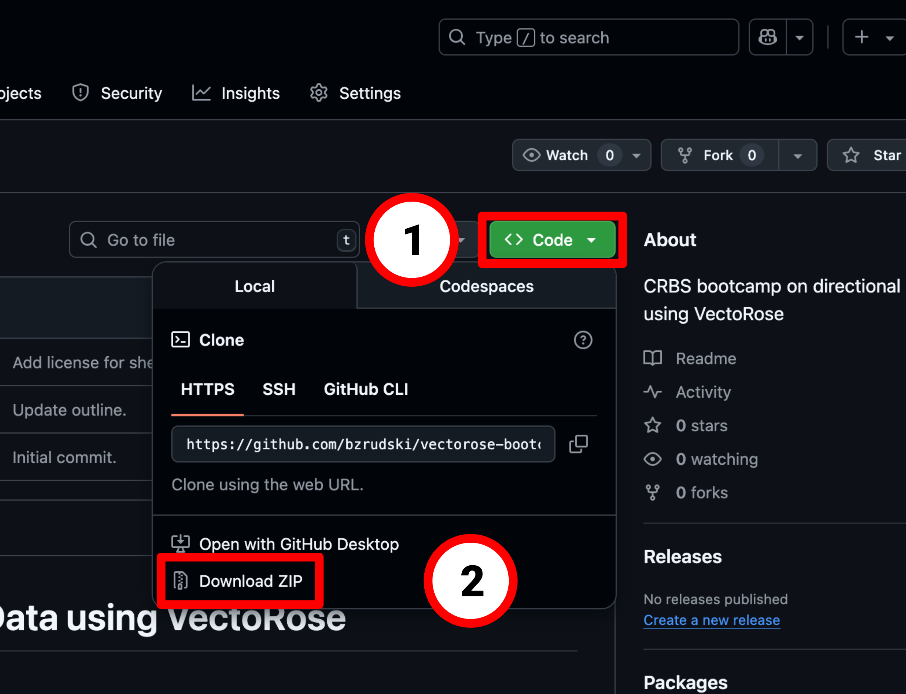

# VectoRose Bootcamp Setup Guide

Benjamin Rudski <benjamin.rudski@mail.mcgill.ca>

Hello everyone! Thank you for signing up for the CRBS bootcamp on analysing directional data using VectoRose. In this guide, I'll explain how to set up everything you need for the bootcamp.

To follow along live with the hands-on sections, you'll need to download the workshop materials from GitHub and install the VectoRose Python package and Jupyter Lab. Then you'll need to open the bootcamp materials in Jupyter Lab.

## Downloading the materials

The bootcamp materials can be found on GitHub at <https://github.com/bzrudski/vectorose-bootcamp>.

To download the material, you may click on the green **Code** button in the top right corner of the page, and then select **Download ZIP**. Save the zip file and then extract its contents.



**Alternatively**, if you're familiar with `git`, you may clone the repository by running this command on the terminal:

```shell
git clone https://github.com/bzrudski/vectorose-bootcamp.git
```

> 💡 **Tip**\
> Remember where you've saved the files! This will be important in a future step.

## Installing VectoRose and Jupyter Lab

VectoRose is a Python package that can easily be installed using `pip`. Similarly, you can easily install Jupyter Lab with `pip`

> ⚠️ **Attention**\
> VectoRose requires Python 3.10 or later.

> 💡 **Tips**\
> If you don't have Python installed, you can easily install it using the miniconda distribution, following the instructions here: <https://www.anaconda.com/docs/getting-started/miniconda/install>
>
> An advantage of using miniconda is it's flexibility when using different environments.
>
> If you do already have Python installed, I recommend looking into creating a new **virtual environment** or a new **Conda environment**. Since VectoRose depends on commonly-used packages, including NumPy, pandas and Matplotlib, creating a new virtual environment will ensure that you don't overwrite the versions of these packages that you already have installed.

To install VectoRose and Jupyter Lab, open a **command line terminal** and run the following:

```shell
pip install vectorose jupyterlab
```

> 📝 **Note**\
> The package names are **case-sensitive**.

> ⚠️ **Warning**\
> Make sure you are running this step in a terminal and not in a Python console.

## Opening Jupyter Lab

Open a command line terminal and type:

```shell
jupyter lab
```

A few messages should appear and then a web browser will open showing the Jupyter interface. In the file pane on the left, navigate to where you downloaded the bootcamp materials. To open a Jupyter notebook, just double-click the file.

## Material Layout

I have provided two versions of the workshop material.

In the `content/student` folder, you'll find the versions of the case study notebooks that have blank cells that I will fill in over the course of the bootcamp through live-coding demonstrations.

In the `content/solutions` folder, you'll find the versions of the case study notebooks with these code cells filled in. This is useful if you don't want to worry about keeping up during the demonstrations, or if you want to go back later and look at the code.

## Questions?

If you have any questions, feel free to reach out to me before the bootcamp.
